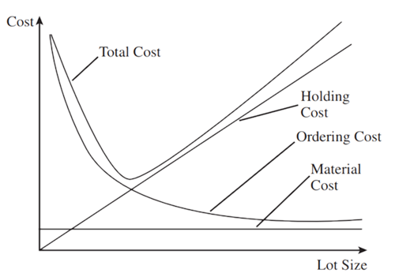
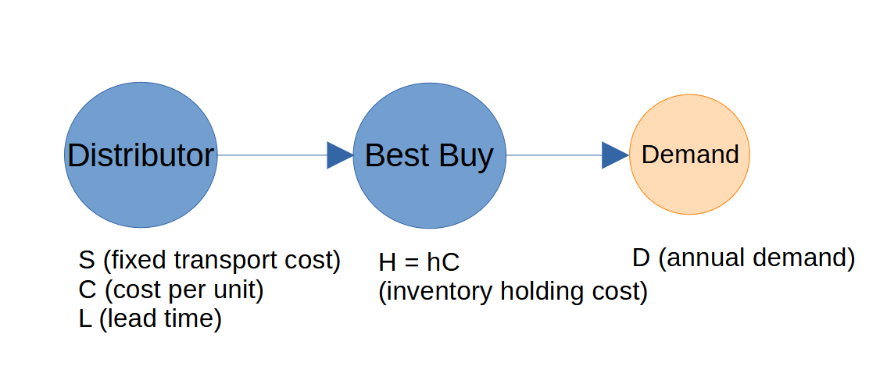
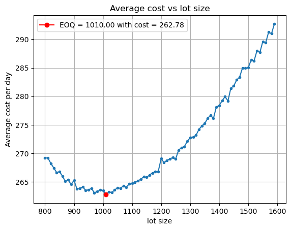

<style> 
img{
  width:75%;
}
</style>
 
<small>This example is from the textbook 
<b>Supply Chain Management: Strategy, Planning, and Operation, (Chopra and Meindl)</b>
</small><br>
<small>Find the Google Colab notebook for this example <a href="https://colab.research.google.com/drive/1SgH4rWlBqm0_zp6I2jGgK5Ghp6tTacLz?usp=sharing" target="_blank">here</a>.</small>

# Estimating Economic Order Quantity (EOQ)

## System Description

As Best Buy sells its current inventory of HP computers, the purchasing manager places a  replenishment order for a new lot of Q computers. Including the cost of transportation, Best Buy incurs a fixed cost of $S per order. The purchasing manager must decide on the number of computers to order from HP in a lot. For this decision, we assume the following inputs:

 - D Annual demand of the product
 - S Fixed cost incurred per order
 - C Cost per unit
 - h Holding cost per year as a fraction of product cost
 
 Assume that HP does not offer any discounts, and each unit costs $C no matter how large an order is. The holding cost is thus given by H = hC. The model is developed using the following basic assumptions:

 1. Demand is steady at D units per unit time.
 2. No shortages are allowed, that is, all demand must be supplied from stock.
 3. Replenishment lead time is fixed (initially assumed to be zero).

The purchasing manager makes the lot-sizing decision to minimize the total cost the store incurs. He or she must consider three costs when deciding on the lot size:

 - Annual material cost
 - Annual ordering cost
 - Annual holding cost

 Because purchase price is independent of lot size, we have

  - Annual material cost = $CD$
 
 The number of orders must suffice to meet the annual demand D. Given a lot size of Q, we thus have

  - Number of orders per year = $\frac{D}{Q}$
 
 Because an order cost of S is incurred for each order placed, we infer that

  - Annual ordering cost = $(\frac{D}{Q}){S}$
 
Given a lot size of Q, we have an average inventory of Q/2. The annual holding cost is thus the cost of holding Q/2 units in inventory for one year and is given as

  - Annual holding cost = $(\frac{Q}{2})H = (\frac{Q}{2})hC$

The total annual cost, TC, is the sum of all three costs and is given as

  - Total annual cost, $TC = CD + (\frac{D}{Q})S + (\frac{Q}{2})hC$



<small> Image source: [Textbook] Supply Chain Management: Strategy, Planning, and Operation, (Chopra and Meindl) </small>

Above figure shows the variation in different costs as the lot size is changed. Observe that  the annual holding cost increases with an increase in lot size. In contrast, the annual ordering cost declines with an increase in lot size. The material cost is independent of lot size because we have assumed the price to be fixed. The total annual cost thus first declines and then increases with an increase in lot size.



From the perspective of the manager at Best Buy, the optimal lot size is one that minimizes the total cost to Best Buy. It is obtained by taking the first derivative of the total cost with respect to Q and setting it equal to 0. The optimum lot size is referred to as the economic order quantity (EOQ). It is denoted by Q* and is given by the following equation:

Optimal lot size, $Q* = \sqrt{\frac{2DS}{hC}}$
 
## Numerical Example

Demand for the Deskpro computer at Best Buy is 1,000 units per month. Best Buy incurs a fixed order placement, transportation, and receiving cost of $4,000 each time an order is placed. Each computer costs Best Buy $500 and the retailer has a holding cost of 20 percent. Evaluate the number of computers that the store manager should order in each replenishment lot.

Analysis:
In this case, the store manager has the following inputs:

 - Annual demand, $D = 1,000 * 12 = 12,000$ units
 - Order cost per lot, $S = 4,000$
 - Unit cost per computer, $C = 500$
 - Holding cost per year as a fraction of unit cost, $h = 0.2$
 
Using the EOQ formula, the optimal lot size is<br>

Optimal order size = Q* =  $\sqrt{\frac{2 * 12,000 * 4,000}{0.2 * 500}} = 980$
 
To minimize the total cost at Best Buy, the store manager orders a lot size of 980 computers for each replenishment order. The cycle inventory is the average resulting inventory and is given by<br>

Cycle inventory = $\frac{Q*}{2} = 490$
 
For a lot size of Q* = 980, the store manager evaluates<br>

Number of orders per year = $\frac{D} {Q*} = \frac{12,000} {980} = 12.24$<br>
Annual ordering and holding cost = $\frac{D} {Q*} S + (\frac{Q*} {2}) hC = 97,980$<br>
Average flow time = $\frac{Q*} {2D} = \frac{490} {12,000} = 0.041$ year $= 0.49$ month

Each computer thus spends 0.49 month, on average, at Best Buy before it is sold because it was purchased in a batch of 980.

## Implementation

```python
import simpy
import numpy as np
import matplotlib.pyplot as plt
import SupplyNetPy.Components as scm

"""
 Demand for the Deskpro computer at Best Buy is 1,000 units per month. Best Buy incurs a fixed order placement, 
 transportation, and receiving cost of $4,000 each time an order is placed. Each computer costs Best Buy $500 
 and the retailer has a holding cost of 20 percent. Evaluate the number of computers that the store manager 
 should order in each replenishment lot.
 
 Analysis:
 In this case, the store manager has the following inputs:
 - Annual demand, D = 1,000 * 12 = 12,000 units (approx 34 units per day)
 - Order cost per lot, S = 4,000 
 - Unit cost per computer, C = 500
 - Holding cost per year as a fraction of unit cost, h = 0.2 (500*0.2 = 100 per year => 100/365 = 0.273 per day)

 Assumptions:
 - Demand is constant and deterministic
 - Lead time is zero

Optimum Economic Order Quantity (EOQ) is determined to minimize the total cost.
Total cost = Annual material cost + Annual ordering cost + Annual holding cost
This is same as -> Total cost = total transportation cost + inventory cost (we'll ignore material cost since it is constant)
"""

D = 12000 # annual demand
d = 34 # daily demand
order_cost = 4000 # order cost
unit_cost = 500 # unit cost
holding_cost = 0.273 # holding cost per day
lead_time = 0 # lead time

simlen = 3650 # simulation length in days

total_cost_arr = []
unsat_arr = []
print(f"lot size \t Inv holding cost \t Order cost \t Average cost(per day) \t Unmet demand")
for lot_size in range(800,1600,10):

    order_interval = 365*lot_size/D
    
    env = simpy.Environment()
    
    hp_supplier = scm.Supplier(env=env, ID="S1", name="HPComputers", node_type="infinite_supplier")

    bestbuy = scm.InventoryNode(env=env, ID="D1", name="Best Buy", node_type="distributor",
                                    capacity=lot_size, initial_level=lot_size, inventory_holding_cost=holding_cost,
                                    replenishment_policy=scm.PeriodicReplenishment, product_buy_price=450,
                                    policy_param={'T':order_interval,'Q':lot_size}, product_sell_price=unit_cost)

    link1 = scm.Link(env=env,ID="l1", source=hp_supplier, sink=bestbuy, cost=order_cost, lead_time=lambda: lead_time)

    demand1 = scm.Demand(env=env,ID="d1", name="demand_d1", order_arrival_model=lambda: 1, 
                        order_quantity_model=lambda: d, demand_node=bestbuy, consume_available=True)
    scm.global_logger.disable_logging() # disable logging for all components
    env.run(until=simlen)

    bb_invlevels = np.array(bestbuy.inventory.instantaneous_levels)
    hp_sup_transportation_cost = bestbuy.stats.transportation_cost

    total_cost = bestbuy.stats.inventory_carry_cost + bestbuy.stats.transportation_cost
    total_cost_arr.append([lot_size, total_cost/simlen])
    
    unsat_demand = demand1.stats.demand_placed[1]-demand1.stats.fulfillment_received[1]
    unsat_arr.append([lot_size,unsat_demand])
    print(f"{lot_size} \t\t {bestbuy.stats.inventory_carry_cost:.2f}\t\t{bestbuy.stats.transportation_cost}\t\t{total_cost/simlen:.2f}\t\t{unsat_demand:.2f}")

total_cost_arr = np.array(total_cost_arr)
unsat_arr = np.array(unsat_arr)
EOQ = np.argmin(total_cost_arr[:,1])

plt.figure()
plt.plot(total_cost_arr[:,0], total_cost_arr[:,1],marker='.',linestyle='-')
plt.plot(total_cost_arr[EOQ,0], total_cost_arr[EOQ,1],marker='o',color='red',label=f'EOQ = {total_cost_arr[EOQ,0]:.2f} with cost = {total_cost_arr[EOQ,1]:.2f}')
plt.xlabel("lot size")
plt.ylabel("Average cost per day")
plt.title("Average cost vs lot size")
plt.legend()
plt.grid()

plt.show()
```
<div style="overflow-y: scroll;height: 350px;">
```
    lot size 	 Inv holding cost 	 Order cost 	 Average cost(per day) 	 Unmet demand
    800 		 386458.80		596000		269.17		4100.00
    810 		 390557.96		592000		269.19		4118.00
    820 		 395049.18		584000		268.23		4140.00
    830 		 400188.24		576000		267.45		4104.00
    840 		 405223.18		568000		266.64		4106.00
    850 		 409730.10		564000		266.78		4114.00
    860 		 414937.16		556000		266.01		4118.00
    870 		 419476.82		548000		265.06		4094.00
    880 		 424411.62		544000		265.32		4114.00
    890 		 429494.01		536000		264.52		4092.00
    900 		 436224.38		532000		265.27		4094.00
    910 		 438638.31		524000		263.74		4074.00
    920 		 442904.09		520000		263.81		4096.00
    930 		 448040.50		516000		264.12		4130.00
    940 		 453707.25		508000		263.48		4108.00
    950 		 458159.42		504000		263.61		4094.00
    960 		 462991.62		500000		263.83		4100.00
    970 		 468226.74		492000		263.08		4110.00
    980 		 472987.11		488000		263.28		4098.00
    990 		 477960.52		484000		263.55		4106.00
    1000 		 481626.60		480000		263.46		4100.00
    1010 		 487159.07		472000		262.78		4104.00
    1020 		 492760.50		468000		263.22		4080.00
    1030 		 496374.95		464000		263.12		4110.00
    1040 		 502052.28		460000		263.58		4092.00
    1050 		 507372.65		456000		263.94		4094.00
    1060 		 511096.54		452000		263.86		4116.00
    1070 		 516617.65		448000		264.28		4124.00
    1080 		 519820.94		444000		264.06		4118.00
    1090 		 525820.83		440000		264.61		4098.00
    1100 		 530125.28		436000		264.69		4098.00
    1110 		 534894.02		432000		264.90		4118.00
    1120 		 539837.84		428000		265.16		4124.00
    1130 		 544889.08		424000		265.45		4116.00
    1140 		 550465.87		420000		265.88		4094.00
    1150 		 554073.29		416000		265.77		4092.00
    1160 		 559606.68		412000		266.19		4110.00
    1170 		 564940.50		408000		266.56		4080.00
    1180 		 569711.55		404000		266.77		4104.00
    1190 		 573919.60		400000		266.83		4080.00
    1200 		 586076.40		396000		269.06		4100.00
    1210 		 583497.57		396000		268.36		4106.00
    1220 		 589075.99		392000		268.79		4098.00
    1230 		 593807.38		388000		268.99		4110.00
    1240 		 598836.42		384000		269.27		4074.00
    1250 		 601944.80		380000		269.03		4100.00
    1260 		 607432.10		380000		270.53		4094.00
    1270 		 613174.10		376000		271.01		4108.00
    1280 		 617805.01		372000		271.18		4074.00
    1290 		 621160.11		372000		272.10		4130.00
    1300 		 627485.86		368000		272.74		4092.00
    1310 		 631953.94		364000		272.86		4074.00
    1320 		 637026.39		360000		273.16		4076.00
    1330 		 640737.93		360000		274.17		4094.00
    1340 		 646993.21		356000		274.79		4092.00
    1350 		 652581.25		352000		275.23		4076.00
    1360 		 655767.11		352000		276.10		4114.00
    1370 		 661892.46		348000		276.68		4094.00
    1380 		 663762.51		344000		276.10		4060.00
    1390 		 671198.93		344000		278.14		4118.00
    1400 		 676112.71		340000		278.39		4080.00
    1410 		 679131.28		340000		279.21		4114.00
    1420 		 685778.46		336000		279.94		4106.00
    1430 		 687048.38		332000		279.19		4084.00
    1440 		 695202.14		332000		281.43		4104.00
    1450 		 700610.60		328000		281.81		4078.00
    1460 		 704462.53		328000		282.87		4108.00
    1470 		 710215.40		324000		283.35		4078.00
    1480 		 716061.53		324000		284.95		4118.00
    1490 		 720095.10		320000		284.96		4084.00
    1500 		 724323.60		316000		285.02		4100.00
    1510 		 729269.91		316000		286.38		4096.00
    1520 		 732658.29		312000		286.21		4078.00
    1530 		 739202.82		312000		288.00		4080.00
    1540 		 742057.54		308000		287.69		4058.00
    1550 		 749044.53		308000		289.60		4104.00
    1560 		 752204.00		304000		289.37		4078.00
    1570 		 759076.52		304000		291.25		4100.00
    1580 		 762089.05		300000		290.98		4070.00
    1590 		 768415.08		300000		292.72		4102.00
```
</div>

<br><br>

## Results



We conducted multiple simulations with varying lengths (1000, 2000, 3000, 4000, 5000, and 6000). Our findings indicated that when the simulation length is less than 4000, the Economic Order Quantity (EOQ) is approximately 1010. Additionally, we found that the results improve as the simulation length increases.