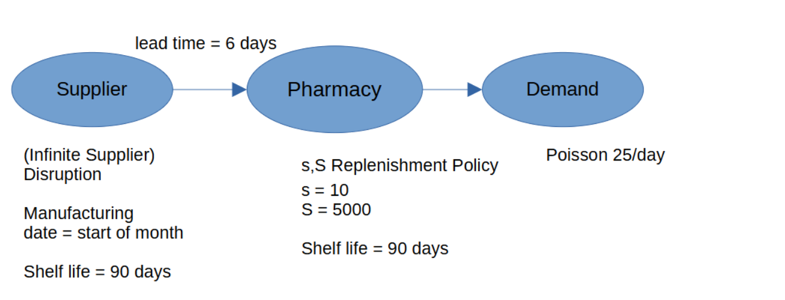
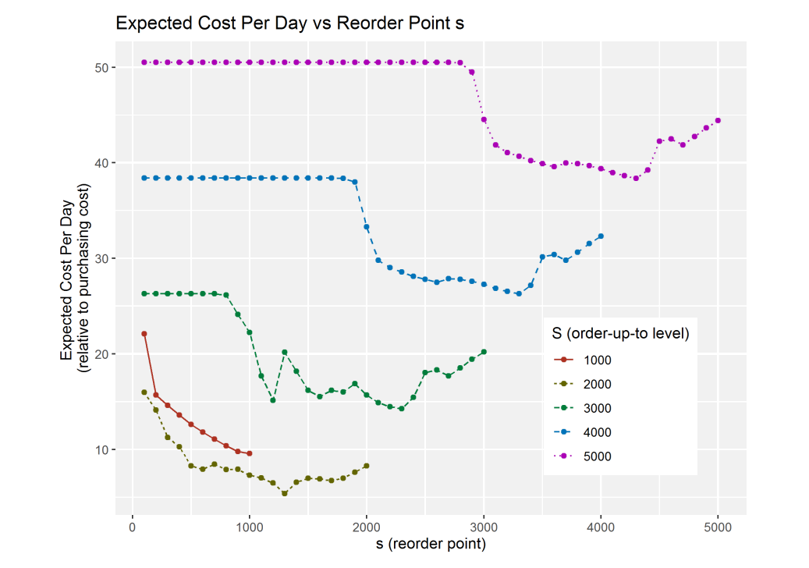

<small>Find the Google Colab notebook for this example <a href="https://colab.research.google.com/drive/1MFIXSqRlrWP5QIQZHiUtqzo6DZFcHA0w?usp=sharing" target="_blank">here</a>.</small>

# Case study 

This study is from a publication __'Improving Simulation Optimization Run Time When Solving For Periodic Review Inventory Policies in A Pharmacy'__, read it [here](https://informs-sim.org/wsc21papers/232.pdf).

In this example, we aim to understand the supply chain network system described by the authors and to use SupplyNetPy to implement it and replicate the results. This exercise allows us to evaluate the complexity of reconstructing a specific system with SupplyNetPy and to validate the library.

## System Description

It is a single echelon supply chain: (A distributor: Hospital Pharmacy, and a supplier: Pharmaceutical Manufacturing Facility)

 - A distributor facing stochastic demand is connected to an infinite supplier.
 - The supplier can be disrupted with probability = 0.001 at given day t.
 - The distributor replenishment policy: (s,S)
 - The product is perishable with shelf life of 90 days.
 - The authors model and simulate the system to find optimum values of policy parameters (s,S) that minimizes total expected cost per day



Inventory Type: Perishable <br>
Inventory position (level at given time t) = inventory on hand + inventory en route <br>
Replenishment Policy: (s,S) When level falls below s, order is placed for (S - current inventory position) units <br>
Review period = 1 day (monitor inventory everyday) <br>
H = Inventory at hand <br>
H' = Inventory at hand that expires at the end of the day t <br>
P = Inventory position = H + inventory en route <br>


This flowchart illustrates the order and sequence of events that take place at the pharmacy. <br>
<small>(<a href="https://informs-sim.org/wsc21papers/232.pdf" target="_blank">Image source</a>)</small>

## Algorithm: Process flow of Perishable Inventory
```algorithm
Begin day t
    1. Order arrive at the Pharmacy
    2. Update Inventory Levels (H)
    3. Satisfy demand based on Inventory Levels
        3.1. If (d>H):
            - demand Satisfied = H
            - Shortage = d-H
            - Waste = 0
        3.2. Else:
            - demand Satisfied = d
            - Shortage = 0
            - Waste = max{0,H'-d}
    4. Discard Expired Drugs
    5. Update Inventory Levels (H)
        5.1. Is (s>P) and (Supplier not Disrupted):
            - Place order for (S-P)
        5.2. Else:
            - Do not place order
    6. End of the day t
```
__Optimization Objective: Minimize Expected Cost per day__ <br>
Costs of interest are shortage, waste, holding and ordering <br>

## Assumptions

 - All drugs that arrive in the same month come from the same production batch and have 
 same end of the month expiration date. Hence drugs are only discarded at the end of the month.
 - The inventory on-hand is know each day.
 - Estimated days until inventory expires is known each day.
 - Lead time is deterministic and +ve. The Order placed at the end of the day (t-1), and arrives at the begining of the day t.
 - Demand is stochastic.
 - Supply uncertainty is due to disruptions
 (these two are independent of each other)
 - All demand that is not met is lost.
 - First in first out protocol is followed when serving orders.

## System Configuration

 - T = number of days (360 days)
 - l = deterministic lead time (6 days)
 - e = shelf life of the drugs (months) (3 months)
 - R = number of simulation replication (5000)
 - b = shortage cost (5 units)
 - z = waste cost (1 units)
 - h = holding cost (0.001 units)
 - o = ordering cost (0.5 units)
 - dt = demand on day t (stochastic) (Poission 25/day)
 - yt = binary variable for supply disruption status on day t (yt=0 disrupted, yt=1 available) (stochastic) (p=0.01)
 - disrupt_time ~ Geom(p=0.01)
 - recovery_time ~ Geom(p=1/30)

## Implementation

```python
import simpy
import numpy as np
import matplotlib.pyplot as plt
from matplotlib.pyplot import figure
import SupplyNetPy.Components as scm
```

```python
class Distributions:
    """
    Class to generate random numbers for demand (order quantity) and order arrival arrival times.
    Parameters:
        mu (float): Mean of the exponential distribution for order arrival times.
        lam (float): Lambda parameter of the Poisson distribution for demand (order quantity).        
    """
    def __init__(self,mu=1,lam=1,p=0.01):
        self.mu = mu
        self.lam = lam
        self.p = p

    def poisson_demand(self):
        return np.random.poisson(self.lam)

    def expo_arrival(self):
        return np.random.exponential(self.mu)
    
    def geometric(self):
        return np.random.geometric(self.p,1)[0]

def manufacturer_date_cal(time_now):
    """Calculate manufacturing date rounded down to the nearest month."""
    return time_now - (time_now % 30) 

# Global parameters
T = 360     #number of days (360 days)
l = 6       #deterministic lead time (6 days)
e = 90      #shelf life of the drugs (months) (3 months)
R = 5000    #number of simulation replication (5000)
b = 5       #shortage cost (5 units)
z = 1       #waste cost (1 units)
h = 0.001   #holding cost (0.001 units)
o = 0.5     #ordering cost (0.5 units)
dt = 25     #demand on day t (stochastic) (Poission 25/day)
# yt = binary variable for supply disruption status on day t (yt=0 disrupted, yt=1 available) (stochastic) (p=0.01)
yt_p = 0.01  # ~ Geometric(p=0.01), sampled from Geometric distribution with probability p = 0.01
yt_r = 1/30 # node recovery time ~ Geometric(p=1/30), sampled from Geometric distribution with probability p = 1/30 = 0.033
price = 7 # unit cost of drug

def setup_simulation(env, s, S, ini_level, st, disrupt_time, recovery_time):
    """Setup environment, supplier, distributor, link, and demand process."""
    supplier = scm.Supplier(env, "S1", "Supplier 1", "infinite_supplier", 
                            node_disrupt_time=disrupt_time.geometric,
                            node_recovery_time=recovery_time.geometric)

    distributor = scm.InventoryNode(env, "D1", "Distributor 1", "distributor",
                                    capacity=float('inf'), initial_level=ini_level,
                                    inventory_holding_cost=h, inventory_type="perishable",
                                    manufacture_date=manufacturer_date_cal, shelf_life=e,
                                    replenishment_policy=scm.SSReplenishment,
                                    policy_param={'s': s, 'S': S},
                                    product_buy_price=0, product_sell_price=price)

    link = scm.Link(env, "l1", supplier, distributor, cost=o, lead_time=lambda: l)

    demand = scm.Demand(env, "d1", "demand 1", order_arrival_model=lambda: 1,
                        order_quantity_model=st.poisson_demand, demand_node=distributor)

    return supplier, distributor, demand, link

def single_sim_run(S, s, ini_level, logging=True):
    """Run a single simulation instance and return expected cost."""
    env = simpy.Environment()
    st = Distributions(mu=1, lam=dt)
    disrupt_time = Distributions(p=yt_p)
    recovery_time = Distributions(p=yt_r)

    supplier, distributor, demand, link = setup_simulation(env, s, S, ini_level, st, disrupt_time, recovery_time)
    
    pharma_chain = scm.create_sc_net(env=env, nodes=[supplier, distributor], links=[link], demands=[demand])
    pharma_chain = scm.simulate_sc_net(pharma_chain,sim_time=30,logging=logging)
    supplier.stats.reset()
    distributor.stats.reset()
    demand.stats.reset()
    pharma_chain = scm.simulate_sc_net(pharma_chain,sim_time=T,logging=logging)

    shortage = distributor.stats.orders_shortage[1]
    waste = distributor.stats.inventory_waste
    holding = distributor.stats.inventory_carry_cost
    transport = distributor.stats.transportation_cost

    total_cost = (shortage * b + waste * z + holding + transport)
    norm_cost = total_cost / ((T - 30) * (b + z + h + o)) * price

    if logging:
        print("Shortage cost:", shortage * b)
        print("Waste cost:", waste * z)
        print("Holding cost:", holding)
        print("Transportation cost:", transport)
    
    return norm_cost

def run_for_s(s_low, s_high, s_step, capacity, ini_level, num_replications):
    """Run simulations across reorder point values and report results."""
    results = []
    st = Distributions(mu=1, lam=dt)
    disrupt_time = Distributions(p=yt_p)
    recovery_time = Distributions(p=yt_r)
    
    
    #print("reorder_point, exp_cost_per_day, std, std_err")
    for s in range(s_low, s_high, s_step):
        costs = []
        for _ in range(num_replications):
            env = simpy.Environment()
            supplier, distributor, demand, link = setup_simulation(env, s, capacity, ini_level, st, disrupt_time, recovery_time)
            
            pharma_chain = scm.create_sc_net(env=env, nodes=[supplier, distributor], links=[link], demands=[demand])
            pharma_chain = scm.simulate_sc_net(pharma_chain,sim_time=30,logging=False)
            supplier.stats.reset()
            distributor.stats.reset()
            demand.stats.reset()
            pharma_chain = scm.simulate_sc_net(pharma_chain,sim_time=T,logging=False)

            shortage = distributor.stats.orders_shortage[1]
            waste = distributor.stats.inventory_waste
            holding = distributor.stats.inventory_carry_cost
            transport = distributor.stats.transportation_cost

            total_cost = (shortage * b + waste * z + holding + transport)
            norm_cost = total_cost / ((T - 30) * (b + z + h + o)) * price
            costs.append(norm_cost)

        mean_cost = np.mean(costs)
        std_dev = np.std(costs)
        std_err = std_dev / np.sqrt(num_replications)

        #print(f"[{s}, {mean_cost}, {std_dev}, {std_err}]")
        results.append((s, mean_cost, std_dev, std_err))

    return results
# Parameters for the simulation
s_low = 100
s_high = 5000
s_step = 100
capacity = 5000
ini_level = 5000
num_rep = 1000
```

## Assessing Time Complexity

First, let's evaluate the time complexity in relation to the number of simulation runs (replications) (R) in order to estimate the expected costs. The code estimates the execution time for R simulations, where R takes on the values of 1000, 2000, 3000, 4000, and 5000.

```python
import time
stats = []
scm.global_logger.disable_logging() # enable logging
for replications in [1000, 2000, 3000, 4000, 5000]:
    exp_cost_arr = []
    start_time = time.time()
    for rep in range(0, replications):
        exp_cost_arr.append(single_sim_run(s=2000,S=5000,ini_level=5000,logging=False))
    exp_cost_arr = np.array(exp_cost_arr)
    exe_time = time.time() - start_time
    print(f"R ={replications}, exe_time:{exe_time} sec, mean:{np.mean(exp_cost_arr)}, std:{np.std(exp_cost_arr)}, std_err:{np.std(exp_cost_arr)/np.sqrt(R)}")
    stats.append((replications, exe_time, np.mean(exp_cost_arr), np.std(exp_cost_arr), np.std(exp_cost_arr)/np.sqrt(replications)))

```

    R =1000, exe_time:22.119476795196533 sec, mean:51.75029532053344, std:23.668711396825312, std_err:0.33472612661285
    R =2000, exe_time:45.451146602630615 sec, mean:51.80183997566808, std:23.633314688276155, std_err:0.33422554155991413
    R =3000, exe_time:68.95947742462158 sec, mean:51.01044921449537, std:23.62288667057547, std_err:0.3340780671193043
    R =4000, exe_time:86.83561849594116 sec, mean:51.584926030610674, std:23.706247962166834, std_err:0.3352569738107588
    R =5000, exe_time:106.06455659866333 sec, mean:52.27106894743466, std:23.863645906143574, std_err:0.3374829168813743
    

## Estimating Confidence Interval

To ensure the estimation error is reasonable, we estimate the expected costs for the replenishment policy setting $S = 5000$ and variable $s$ with $R = 1000$ simulation runs and plot the confidence intervals.

```python
exp_cost_per_day = run_for_s(s_low=s_low,s_high=s_high,s_step=s_step,capacity=capacity,ini_level=ini_level,num_replications=num_rep)
exp_cost_per_day = np.array(exp_cost_per_day)

figure(figsize=(25, 10), dpi=60)
plt.plot(exp_cost_per_day[:,0], exp_cost_per_day[:,1],marker='o', linestyle='-', color='b', label='S=5000')
plt.fill_between(exp_cost_per_day[:,0], exp_cost_per_day[:,1]-2*exp_cost_per_day[:,3], exp_cost_per_day[:,1]+2*exp_cost_per_day[:,3],alpha=0.2, color='b', label='95% CI')
plt.xlabel('Reorder Point (s)')
plt.ylabel('Expected Cost per Day')
plt.xticks(np.arange(s_low, s_high, 200))
plt.title('Expected Cost per Day vs Reorder Point (s)')
plt.legend()
plt.grid()
plt.show()
```


## Running the Model with Varying (S, s)

To determine the optimal values of the parameters $S$ and $s$, we run the model with different settings for both parameters. The parameter $S$ takes on values of 1000, 2000, 3000, 4000, and 5000. For each value of $S$, the parameter $s$ is set to values ranging from 100 up to $S$. The results obtained from these runs are then plotted and compared with the findings reported by the authors. Below, we present both sets of plots for comparison.


```python
exp_cost_per_day = run_for_s(s_low=s_low, s_high=5000, s_step=s_step, capacity=5000, ini_level=5000, num_replications=num_rep)
exp_cost_per_day = np.array(exp_cost_per_day)

exp_cost_per_day2 = run_for_s(s_low=s_low,s_high=4000,s_step=s_step,capacity=4000,ini_level=4000,num_replications=num_rep)
exp_cost_per_day2 = np.array(exp_cost_per_day2)

exp_cost_per_day3 = run_for_s(s_low=s_low,s_high=3000,s_step=s_step,capacity=3000,ini_level=3000,num_replications=num_rep)
exp_cost_per_day3 = np.array(exp_cost_per_day3)

exp_cost_per_day4 = run_for_s(s_low=s_low,s_high=2000,s_step=s_step,capacity=2000,ini_level=2000,num_replications=num_rep)
exp_cost_per_day4 = np.array(exp_cost_per_day4)

exp_cost_per_day5 = run_for_s(s_low=s_low,s_high=1000,s_step=s_step,capacity=1000,ini_level=1000,num_replications=num_rep)
exp_cost_per_day5 = np.array(exp_cost_per_day5)

figure(figsize=(25, 10), dpi=60)
plt.plot(exp_cost_per_day[:,0], exp_cost_per_day[:,1],marker='o', linestyle='-', color='m', label='S=5000')
plt.plot(exp_cost_per_day2[:,0], exp_cost_per_day2[:,1],marker='o', linestyle='-', color='b', label='S=4000')
plt.plot(exp_cost_per_day3[:,0], exp_cost_per_day3[:,1],marker='o', linestyle='-', color='g', label='S=3000')
plt.plot(exp_cost_per_day4[:,0], exp_cost_per_day4[:,1],marker='o', linestyle='-', color='c', label='S=2000')
plt.plot(exp_cost_per_day5[:,0], exp_cost_per_day5[:,1],marker='o', linestyle='-', color='r', label='S=1000')
plt.xticks(np.arange(s_low, s_high, 200))
plt.xlabel('Reorder Point (s)')
plt.ylabel('Expected Cost per Day')
plt.title('Expected Cost per Day vs Reorder Point (s)')
plt.legend()
plt.grid()
plt.show()
``` 
    


The following plot displays the results obtained by the authors.

