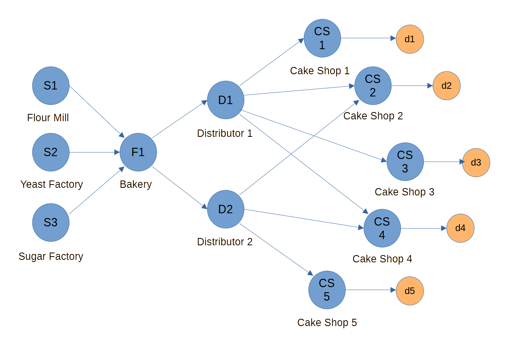

# SupplyNetPy: Complex Hybrid Network Example

This example demonstrates how to build and simulate a multi‑echelon, hybrid supply chain with different replenishment policies in **SupplyNetPy**.



## Goals

* Creating a network with multiple raw materials, suppliers, a manufacturer, two distributors, and several retailers.
* Mix replenishment policies (\`SS\`, \`RQ\`, \`Periodic\`).
* Include hybrid connections (ordering from multiple distributors).

## Key Concepts Used

* **Products, Raw Materials**: Class `Product` used to create a product, Bread, with some shelf life, `RawMaterial` is used to create raw materials (dough, sugar, yeast)
* **Nodes**: Clasees `Supplier`, `Manufacturer`, `InventoryNode` are used to create suppliers,  bakery (factory), distributors, and retailers (cake shops).
* **Links**: Class `Link` is used to link different nodes in the network
* **Policies**:
    * `SSReplenishment`: order up to **S** when inventory <= **s**
    * `RQReplenishment`: reorder point **R**, fixed order quantity **Q**
    * `PeriodicReplenishment`: review every **T**, order **Q**.
* **Perishability**: `inventory_type` for all nodes is `perishable`, and parameter `shelf_life` is passed. 

## Full Example

> This script constructs a hybrid network with two distributors and five retailers, then runs a short simulation.

```python
{{include('examples/py/hybrid_big_sc.py')}}
```

## Sample Output

```
INFO sim_trace - Supply chain info:
INFO sim_trace - available_inv                     : 278
INFO sim_trace - avg_available_inv                 : 257.95890410958907
INFO sim_trace - avg_cost_per_item                 : 1.7910691476933545
INFO sim_trace - avg_cost_per_order                : 301.4538286442927
INFO sim_trace - backorders                        : [197, 38506]
INFO sim_trace - demand_by_customers               : [18147, 45404]
INFO sim_trace - demand_by_site                    : [526, 3097438]
INFO sim_trace - demands                           : {'d1': Demand Shop 1, 'd2': Demand Shop 2, 'd3': Demand Shop 3, 'd4': Demand Shop 4, 'd5': Demand Shop 5}
INFO sim_trace - env                               : <simpy.core.Environment object at 0x000001EE9DE2CCD0>
INFO sim_trace - fulfillment_received_by_customers : [1225, 3018]
INFO sim_trace - fulfillment_received_by_site      : [508, 3095180]
INFO sim_trace - inventory_carry_cost              : 35929.34227487656
INFO sim_trace - inventory_spend_cost              : 5110529.0
INFO sim_trace - inventory_waste                   : 45922
INFO sim_trace - links                             : {'l1': fmill to bakery, 'l2': sfact to bakery, 'l3': yfact to bakery, 'l4': bakery to dist1, 'l5': bakery to dist2, 'l6': dist1 to cake_shop1, 'l7': dist1 to cake_shop2, 'l8': dist1 to cake_shop3, 'l9': dist2 to cake_shop4, 'l10': dist2 to cake_shop5, 'l11': dist1 to cake_shop4, 'l12': dist2 to cake_shop2}
INFO sim_trace - nodes                             : {'fmill': Flour Mill, 'sfact': Sugar Factory, 'yfact': Yeast Factory, 'bakery': Bakery, 'dist1': Distributor 1, 'dist2': Distributor 2, 'cake_shop1': Cake Shop 1, 'cake_shop2': Cake Shop 2, 'cake_shop3': Cake Shop 3, 'cake_shop4': Cake Shop 4, 'cake_shop5': Cake Shop 5}
INFO sim_trace - num_distributors                  : 2
INFO sim_trace - num_manufacturers                 : 1
INFO sim_trace - num_of_links                      : 12
INFO sim_trace - num_of_nodes                      : 11
INFO sim_trace - num_retailers                     : 5
INFO sim_trace - num_suppliers                     : 3
INFO sim_trace - profit                            : -3670687.3422748772
INFO sim_trace - revenue                           : 1958360
INFO sim_trace - shortage                          : [17119, 62162]
INFO sim_trace - total_cost                        : 5629047.342274877
INFO sim_trace - total_demand                      : [18673, 3142842]
INFO sim_trace - total_fulfillment_received        : [1733, 3098198]
INFO sim_trace - transportation_cost               : 3019
---- Node-wise performance ----
---- ---- Suppliers and Bakery---- ----
Performance Metric       Flour Mill               Sugar Factory            Yeast Factory            Bakery
backorder                [0, 0]                   [0, 0]                   [0, 0]                   [146, 36307]
demand_fulfilled         [33, 1508340]            [34, 776175]             [33, 758400]             [271, 47734]
demand_placed            [0, 0]                   [0, 0]                   [0, 0]                   [100, 3042915]
demand_received          [33, 1508340]            [34, 776175]             [33, 758400]             [282, 49867]
fulfillment_received     [0, 0]                   [0, 0]                   [0, 0]                   [100, 3042915]
inventory_carry_cost     0                        0                        0                        26089.49999999999
inventory_level          0                        0                        0                        223
inventory_spend_cost     0                        0                        0                        5009175.0
inventory_waste          0                        0                        0                        0
node_cost                0                        0                        0                        5515368.5
orders_shortage          [0, 0]                   [0, 0]                   [0, 0]                   [146, 18788]
profit                   3770850.0                1086645.0                151680.0                 -3844678.5
revenue                  3770850.0                1086645.0                151680.0                 1670690
total_material_cost      0                        0                        0                        N/A
total_raw_materials_mined0                        0                        0                        N/A
transportation_cost      0                        0                        0                        534

---- ---- Distributors ---- ----
Performance Metric       Distributor 1            Distributor 2
backorder                [32, 943]                [19, 1256]
demand_fulfilled         [65, 1466]               [72, 3065]
demand_placed            [138, 6900]              [144, 42967]
demand_received          [71, 1541]               [73, 3115]
fulfillment_received     [134, 6700]              [137, 41034]
inventory_carry_cost     1775.2200945551504       7597.446945397089
inventory_level          14                       41
inventory_spend_cost     0                        0
inventory_waste          5953                     38436
node_cost                2603.2200945551504       8605.446945397089
orders_shortage          [32, 541]                [19, 590]
profit                   50172.77990544485        104799.5530546029
revenue                  52776                    113405
transportation_cost      828                      1008

---- ---- Retail Shops ---- ----
Performance Metric       Cake Shop 1              Cake Shop 2              Cake Shop 3              Cake Shop 4              Cake Shop 5
backorder                [0, 0]                   [0, 0]                   [0, 0]                   [0, 0]                   [0, 0]
demand_fulfilled         [153, 359]               [290, 676]               [45, 112]                [82, 213]                [655, 1658]
demand_placed            [20, 515]                [45, 846]                [6, 180]                 [6, 240]                 [67, 2875]
demand_received          [153, 359]               [290, 676]               [45, 112]                [82, 213]                [655, 1658]
fulfillment_received     [19, 493]                [40, 793]                [6, 180]                 [6, 240]                 [66, 2825]
inventory_carry_cost     52.081002026990205       50.26761820324603        15.912652408756312       23.449551363101648       325.46441092223466
inventory_level          0                        0                        0                        0                        0
inventory_spend_cost     12325                    18239                    3600                     5040                     62150
inventory_waste          150                      137                      53                       12                       1181
node_cost                12457.081002026991       18469.267618203245       3639.9126524087565       5093.449551363102        62810.464410922235
orders_shortage          [1627, 4059]             [4053, 10223]            [2824, 7100]             [3634, 9089]             [4784, 11772]
profit                   1902.918997973009        7894.732381796755        840.0873475912435        3213.550448636898        5167.535589077765
revenue                  14360                    26364                    4480                     8307                     67978
transportation_cost      80                       180                      24                       30                       335
```


## Suggested Experiments

* Vary `policy_param` values (`s/S`, `R/Q`, `T/Q`).
* Change `lead_time` lambdas and link costs.
* Switch retailer `inventory_type` and `shelf_life` to study perishability.
* Add/remove cross‑links to test resilience.

## Notes

* Keep node IDs unique.
* Ensure `product_buy_price` ≤ upstream `product_sell_price` where applicable.
* Use consistent time units across processing, lead times, and review periods.
