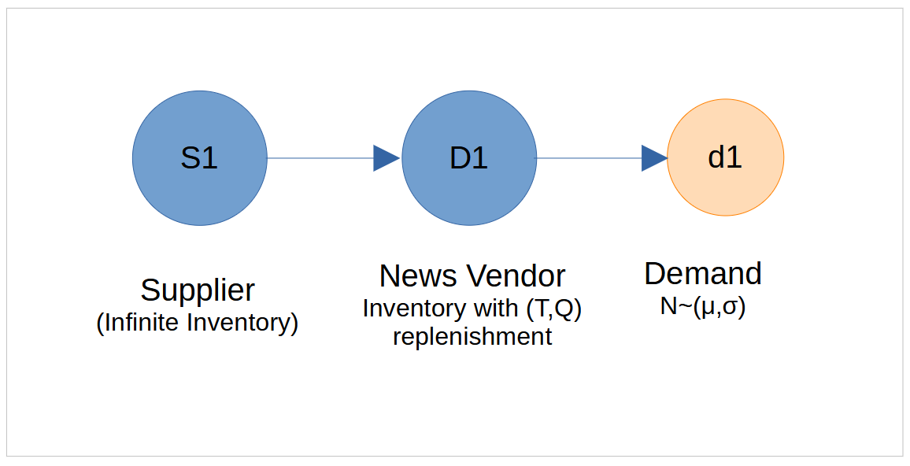

<style>
    img{
        width:500px;
    }
</style>

# Introduction

This example illustrates how to model and simulate the classic **newsvendor problem**. In this problem, a decision-maker must determine the optimal order quantity for a perishable product with uncertain demand, aiming to maximize expected profit by balancing the risks of overstocking and understocking. 

## Problem Definition

The newsvendor orders Q units every day. Each unit costs c, and the selling price is p. The newsvendor faces normally distributed demand with mean &mu; and standard deviation &sigma;. If, on a certain day, the actual demand is k, then the net profit after selling k units is calculated as:

<span>
    <strong>Profit</strong> = <strong>Revenue</strong> &minus; <strong>Order Cost</strong> = <em>k</em> &times; <em>p</em> &minus; <em>Q</em> &times; <em>c</em>
</span>

However, if there are any units left unsold at the end of the day, they are considered wastage since they cannot be sold the next day. The newsvendor can sell these unsold units back to the supplier at a lower price, called the salvage value s. If the actual demand that day is less than the order size Q, then the net profit is thus calulated as:

<span>
    <strong>Profit</strong> = <strong>Revenue</strong> + <strong>Salvage</strong> &minus; <strong>Order Cost</strong> = <em>k</em> &times; <em>p</em> + (<em>Q</em> &minus; <em>k</em>) &times; <em>s</em> &minus; <em>Q</em> &times; <em>c</em>
</span>

When the actual demand <em>k</em> exceeds the newsvendor's order quantity <em>Q</em>, the profit is calculated as:

<span>
    <strong>Profit</strong> = <em>Q</em> &times; <em>p</em> &minus; <em>Q</em> &times; <em>c</em>
</span>

In this case, all available units are sold, and the profit is based on the total revenue from selling <em>Q</em> units minus the total ordering cost.

So, the newsvendor problem is defined by following parameters.

- **Ordering cost (c)**: Cost per unit ordered.
- **Selling price (p)**: Price per unit sold.
- **Salvage value (s)**: Value per unsold unit at the end of the period.
- **Mean demand (&mu;)**: Average demand during the period.
- **Standard deviation of demand (&sigma;)**: Demand variability.
- **Number of samples (n)**: Number of demand samples for simulation.
- **Order quantity (Q)**: Quantity ordered for the period.

The objective is to find the order quantity Q<sup>*</sup> that maximizes expected profit.



## Analytical Solution

The optimal order quantity is given by:

<span>
    Q<sup>*</sup> = &mu; + &sigma; &middot; &Phi;<sup>&minus;1</sup>
    (<span style="vertical-align:middle;">C<sub>u</sub> / (C<sub>u</sub> + C<sub>o</sub>)</span>)
</span>

where:

- C<sub>u</sub> = p - c: Underage cost (profit lost per unit of unmet demand)
- C<sub>o</sub> = c - s: Overage cost (cost per unsold unit)
- &Phi;<sup>-1</sup>: Inverse standard normal 
- C<sub>u</sub>/(C<sub>u</sub> + C<sub>o</sub>): Critical ratio (proportion of demand to satisfy)

## Example Parameters

Given:<br>
  c = 2<br>
  p = 5<br>
  s = 1<br>
  &mu; = 100<br>
  &sigma; = 15<br>
  n = 1000<br>
  Q = 100 (example order quantity)<br>

Plugging in the values:<br>
C<sub>u</sub> = 5 - 2 = 3<br>
C<sub>o</sub> = 2 - 1 = 1<br>
Critical ratio = 3/(3 + 1) = 0.75<br>
Q<sup>*</sup> = 100 + 15 &middot; &Phi;<sup>-1</sup>(0.75)<br>
Q<sup>*</sup> &approx; 100 + 15 &middot; 0.6745 = 110.12<br>
So, the optimal order quantity is approximately **110 units**.<br>

## Simulation Approach

Below is a Python simulation using the `SupplyNetPy` library to estimate the optimal order quantity by evaluating profits across a range of possible order quantities:

```python

import SupplyNetPy.Components as scm
import simpy
import numpy as np
import random
import matplotlib.pyplot as plt

# Parameters for the normal distribution
mean = 100
std_dev = 15
sim_len = 1000 # 1 unit of simulation time = 1 day

cost = 2
sell_price = 5
salvage = 1

profit_arr = [] # to list profit values calculated for different values of Q (order_quantity)

def normal_quantity():
    """
    This function samples number of units to order using a normal distribution
    """
    sample = random.gauss(mean, std_dev)
    if(sample<0):
        sample = 1
    return int(sample)

# calculate profit for different Q values in range 10 to 200
for order_quantity in range(10, 201, 10):
    env = simpy.Environment() # create a simpy environment

    # create an infinite supplier
    supplier1 = scm.Supplier(env=env, ID="S1", name="Supplier1", node_type="infinite_supplier")

    #create the distributor with perishable inventory and periodic replenishment policy
    newsvendor1 = scm.InventoryNode(env=env, ID="NV", name="Newsvendor", node_type="distributor",
                                    capacity=order_quantity, initial_level=order_quantity, inventory_holding_cost=0.1,
                                    inventory_type="perishable", shelf_life=1, replenishment_policy="periodic",
                                    policy_param=[1,order_quantity])

    # create a link between supplier and newsvendor with lead time = 0
    link1 = scm.Link(env=env,ID="l1", source=supplier1, sink=newsvendor1, cost=100, lead_time=lambda: 0)

    # create a demand with order size sampled from normally distributed demand
    demand1 = scm.Demand(env=env,ID="dn", name="demand_d1", 
                        order_arrival_model=lambda: 1.00001, 
                        order_quantity_model=normal_quantity, demand_node=newsvendor1,
                        tolerance=0.2)

    # disable logging
    scm.global_logger.disable_logging()
    env.run(until=sim_len) # run the simulation

    # Calculate the cost and profit for given Q value
    daily_sales = np.array(newsvendor1.products_sold_daily)
    if(newsvendor1.inventory.inventory.waste): # see if there is any waste
        wasted_inventory = np.array(newsvendor1.inventory.inventory.waste)
    else:
        wasted_inventory = np.array([[0,0]])
    everyday_profit = (sum(daily_sales[:,1])*(sell_price) + sum(wasted_inventory[:,1])*salvage - order_quantity*sim_len*cost)/sim_len
    profit_arr.append([order_quantity,everyday_profit]) # record profit and repective Q value

profit_arr = np.array(profit_arr)
# plotting the results
Q = np.argmax(profit_arr[:,1])
plt.plot(profit_arr[:,0], profit_arr[:,1], marker='.', linestyle='-', color='b')
plt.plot(profit_arr[Q,0], profit_arr[Q,1], marker='o', linestyle='-', color='r', label=f'Q={profit_arr[Q,0]}')
plt.xlabel('Order Quantity')
plt.ylabel('Profit')
plt.title('Profit vs Order Quantity')
plt.legend()
plt.grid()
plt.show()
```
The following plot shows the relationship between profit and order quantity (Q). The curve clearly indicates that the maximum profit is achieved when Q is approximately 110, confirming the analytical solution for the optimal order quantity.


**Notes on the Simulation Setup:**

- An *infinite\_supplier* is used to ensure unlimited supply to the newsvendor.
- The focus of the simulation is on the newsvendor node (`newsvendor1`), which:
    - Maintains perishable inventory with a shelf life of 1 day.
    - Uses a periodic replenishment policy, ordering every day.
- The link between the supplier and the newsvendor has a lead time of 0, meaning orders are delivered immediately each day.
- Demand is modeled as a normal distribution. The `normal_quantity()` function samples order sizes from this distribution.
- Customer tolerance is set to 0.2, allowing partial fulfillment of orders. For example, if the order size is 100 and only 80 units are in stock, 80 units are supplied immediately, and the customer waits up to 0.2 days for the remainder.
- If the remaining demand cannot be fulfilled within the tolerance period, the customer leaves. The tolerance is purposefully set to 0.2; if there were no tolerance, the customer would leave without consuming any units.
- This setup ensures that the simulation accurately represents the intended demand and fulfillment process for the newsvendor problem.

## Takeway

This example demonstrated how to solve the newsvendor problem using simulation-based approaches using SupplyNetPy library. By simulating different order quantities and evaluating the resulting profits, you can visualize and confirm the optimal order quantity that maximizes expected profit. This approach can be extended to more complex inventory scenarios and demand distributions, providing valuable insights for inventory management decisions.