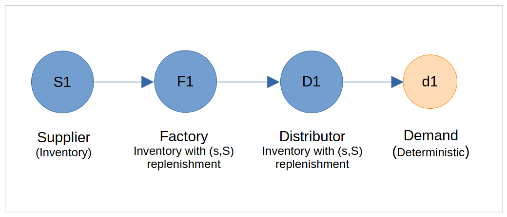

# SupplyNetPy Example: Six-Node Supply Chain

This example demonstrates how to model and simulate a simple supply chain network for a single product using SupplyNetPy. The network consists of six nodes: a supplier, a manufacturer, a distributor, and three retailers. Retailers replenish inventory from the distributor, while the manufacturer sources raw materials from the supplier. The supplier is assumed to have an infinite supply of raw materials.



## 1. Importing the Library

```python
import SupplyNetPy.Components as scm
```

## 2. Defining Supply Chain Nodes

Each node is defined as a dictionary with required parameters. All nodes are collected in a list called `nodes`.

```python
nodes = [
        {'ID': 'S1', 'name': 'Supplier 1', 'node_type': 'infinite_supplier'},

        {'ID': 'M1', 'name': 'Manufacturer 1', 'node_type': 'manufacturer',
         'capacity': 300, 'initial_level': 200, 'inventory_holding_cost': 0.5,
         'replenishment_policy': 'sS', 'policy_param': [150], 'product_sell_price': 310},

        {'ID': 'D1', 'name': 'Distributor 1', 'node_type': 'distributor',
         'capacity': 200, 'initial_level': 50, 'inventory_holding_cost': 1,
         'replenishment_policy': 'sS', 'policy_param': [100], 'product_sell_price': 320},

        {'ID': 'R1', 'name': 'Retailer 1', 'node_type': 'retailer',
         'capacity': 100, 'initial_level': 50, 'inventory_holding_cost': 3,
         'replenishment_policy': 'sS', 'policy_param': [50], 'product_sell_price': 330},

        {'ID': 'R2', 'name': 'Retailer 2', 'node_type': 'retailer',
         'capacity': 100, 'initial_level': 50, 'inventory_holding_cost': 3,
         'replenishment_policy': 'sS', 'policy_param': [50], 'product_sell_price': 335},

        {'ID': 'R3', 'name': 'Retailer 3', 'node_type': 'retailer',
         'capacity': 100, 'initial_level': 50, 'inventory_holding_cost': 3,
         'replenishment_policy': 'sS', 'policy_param': [50], 'product_sell_price': 325}
]
```

> **Note:**  
> The `sS` replenishment policy is a reorder level-based policy: when inventory drops below threshold `s`, an order is placed to restock up to capacity `S`.

## 3. Defining Links Between Nodes

Links represent the flow of products between nodes, with associated transportation costs and lead times.

```python
import random

LOW = 1
HIGH = 4
# let us sample the lead time for these links from a uniform distribution
def sample_from_uniform(low = LOW, high = HIGH): 
        return random.randint(start = low, stop = high)

links = [
        {'ID': 'L1', 'source': 'S1', 'sink': 'M1', 'cost': 5, 'lead_time': sample_from_uniform},
        {'ID': 'L2', 'source': 'M1', 'sink': 'D1', 'cost': 5, 'lead_time': sample_from_uniform},
        {'ID': 'L3', 'source': 'D1', 'sink': 'R1', 'cost': 5, 'lead_time': sample_from_uniform},
        {'ID': 'L4', 'source': 'D1', 'sink': 'R2', 'cost': 5, 'lead_time': sample_from_uniform},
        {'ID': 'L5', 'source': 'D1', 'sink': 'R3', 'cost': 5, 'lead_time': sample_from_uniform},
]
```

## 4. Modeling Demand

Demand is generated at the retailer nodes using deterministic arrival and quantity models.

```python

Q_low = 5
Q_high = 15
# let us sample the order size from a uniform distribution
def random_quantity(low = Q_low, high = Q_high):
        return random.randint(start = low, stop = high)


demands = [
        {'ID': 'demand_R1', 'name': 'Demand 1', 'node_type': 'demand',
         'order_arrival_model': lambda: 1, 'order_quantity_model': random_quantity, 'demand_node': 'R1'},

        {'ID': 'demand_R2', 'name': 'Demand 2', 'node_type': 'demand',
         'order_arrival_model': lambda: 1, 'order_quantity_model': random_quantity, 'demand_node': 'R2'},

        {'ID': 'demand_R3', 'name': 'Demand 3', 'node_type': 'demand',
         'order_arrival_model': lambda: 1, 'order_quantity_model': random_quantity, 'demand_node': 'R3'}
]
```

## 5. Running the Simulation

Create the supply chain network and simulate for 30 time units.

```python
scm.global_logger.enable_logging()
supplychainnet = scm.simulate_sc_net(scm.create_sc_net(nodes, links, demands), sim_time=30)
```

---

**Key Takeaways:**
- The simulation demonstrates how inventory depletes over time and how unmet demand accumulates when supply is insufficient.
- You can modify node parameters, replenishment policies, or demand models to explore different supply chain behaviors.

