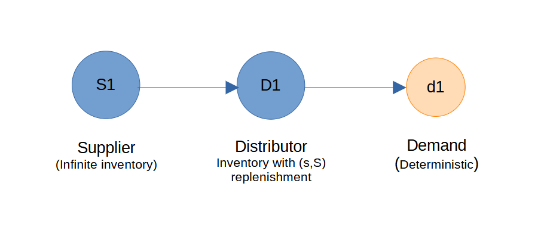

# SupplyNetPy in 10 Minutes

## Installation

SupplyNetPy can be installed using pip:

```sh
pip install supplynetpy
```

## Quick Start: Building a Simple Three-Node Supply Chain

Follow these steps to create and simulate a basic supply chain with a supplier and a manufacturer:



### Import the Library

```python
import SupplyNetPy.Components as scm
```

The `Components` module gives you the building blocks of a supply chain — nodes (suppliers, factories, warehouses, retailers), products and inventory, demand, and the links that connect everything together — which you assemble into a model that fits your scenario.

### Create Nodes

Let us create a supplier node in the supply chain that has infinite inventory and can supply any required quantity of product units to a consumer node. The supplier node requires several parameters, including ID, name, and node type. To set it as an infinite supplier, we must specify the node type as `infinite_supplier`.

```python

```

A distributor or warehouse node that purchases products from a supplier is created below by specifying configurable parameters, including ID, name, inventory capacity, replenishment policy, policy parameters, product buy price, and product sell price. 

```python

```

When creating a manufacturer, distributor, wholesaler, or retailer, we must specify the inventory replenishment policy and its parameters.

The SupplyNetPy Components module includes an `InventoryReplenishment` class that can be customized to define specific replenishment policies. Currently, SupplyNetPy supports the following replenishment policies:


- <p> [Reorder-level (s,S)](api-reference/api-ref-core.md#SupplyNetPy.Components.core.SSReplenishment) — continuously monitor inventory and replenish up to S when the level drops below s. Parameters: {s, S} &nbsp;&nbsp; (class `SSReplenishment`) </p>

- <p> [Reorder-level (s,S) with Safety Stock](api-reference/api-ref-core.md#SupplyNetPy.Components.core.SSReplenishment) — reorder-level replenishment that factors in a safety stock buffer. Parameters: {s, S, safety_stock} (`SSReplenishment`) </p>

- <p> [Replenish Quantity (RQ)](api-reference/api-ref-core.md#SupplyNetPy.Components.core.RQReplenishment) — reorder a fixed quantity Q when placing an order. Parameters: {R, Q} (`RQReplenishment`) </p>

- <p> [Replenish Quantity (RQ) with safety stock](api-reference/api-ref-core.md#SupplyNetPy.Components.core.RQReplenishment) — reorder a fixed quantity Q when placing an order. Parameters: {R, Q, safety_stock} (`RQReplenishment`) </p>

- <p> [Periodic (T,Q)](api-reference/api-ref-core.md#SupplyNetPy.Components.core.PeriodicReplenishment) — replenish inventory every T days with Q units. Parameters: {T, Q} (`PeriodicReplenishment`) </p>

- <p> [Periodic (T,Q) with safety stock](api-reference/api-ref-core.md#SupplyNetPy.Components.core.PeriodicReplenishment) — replenish inventory every T days with Q units. If safety stock is specified, then when the safety stock level is violated, order Q units in addition to the quantity needed to maintain safety stock levels. Parameters: {T, Q, safety_stock} (`PeriodicReplenishment`) </p>

### Create a Link

A link is created as described below. It is configured using parameters such as transportation cost and lead time. The lead time parameter accepts a generative function that produces random lead times based on a specified distribution. Users can create this function according to their needs or define a constant lead time using a Python lambda function.

```python

```

### Specify Demand

A demand is created by specifying an ID, name, the node where the demand occurs, how often orders arrive, and how big each order is. The "how often" and "how big" values are each given as a small zero-argument function that returns a number. If you want randomness — say, customer arrivals drawn from an exponential distribution — write a function that samples from that distribution and returns one number per call. If you want a fixed value, just use a one-line `lambda` such as `lambda: 1`. Demand can be placed at either a distributor or a retailer. The example below sets up a steady demand of 10 units per day at distributor D1.

```python

```

### Assemble and Simulate the Network

To create and simulate the supply chain, use the `create_sc_net` function to instantiate the supply chain nodes and assemble them into a network. This function adds metadata to the supply chain, such as the number of nodes, and other relevant information, keeping everything organized. It returns a Python dictionary containing all supply chain components and metadata. The `simulate_sc_net` function then simulates the supply chain network over a specified period and provides a log of the simulation run. It also calculates performance measures such as net profit, throughput, and more. Let's use these functions to build and simulate our supply chain.

```python

```

### Review Results

After the simulation, inspect `supplychainnet` to view performance metrics for the supply chain nodes. By default, the simulation log is displayed in the console and saved to a local file named `simulation_trace.log`, which is located in the same directory as the Python script. Each node in the simulation has its own logger, and logging can be enabled or disabled by providing an additional parameter: `logging=True` or `logging=False` while creating the node. SupplyNetPy also exposes a package-level handle `scm.global_logger` for bulk toggling all simulation logs at once: call `scm.global_logger.enable_logging()` or `scm.global_logger.disable_logging()`.

**Repeating the same run.** Some parts of the simulation involve randomness — for example, when a node or a link fails by chance (`failure_p`, `node_disrupt_time`, and similar settings on `Link`). By default, every run draws different random numbers, so two back-to-back runs may give slightly different results. If you want to repeat *exactly the same run* — for instance, to compare two policies under the same sequence of failures — call `scm.set_seed(n)` once before you build the network. If you want even finer control, you can also create your own random-number generator with `random.Random()` and pass it as the `rng=` argument when you create a node or a link; that node or link will then use its own random stream, independent of the rest.

Below is an example of a simulation log generated by this program. At the end of the log, supply chain-level performance metrics are calculated and printed. These performance measures are computed for each node in the supply chain and include:

- Inventory carry cost (holding cost)
- Inventory spend (replenishment cost)
- Transportation cost
- Total cost
- Revenue
- Profit

<div id="" style="overflow:scroll; height:600px;">
```

```
</div>

To access node performance metrics easily, call `node.stats.get_statistics()`. In this example, the `D1` node level statistics can be accessed with the following code:

```python

```
Here is the output produced by the code mentioned above.
```

```
---

## Alternative Approach: Using Object-Oriented API

This approach demonstrates how to build and simulate a supply chain using SupplyNetPy's object-oriented API. Instead of passing dictionaries to utility functions, we instantiate supply chain components as Python objects, providing greater flexibility and extensibility. Each node and link is created as an object, and the simulation is managed within a SimPy environment, allowing for more advanced customization and integration with other SimPy-based processes.

```python

```

This script generates an identical simulation log because the network configuration and demand are deterministic. Final statistics will not be included in the log, as overall supply chain statistics are calculated by the function `simulate_sc_net`. However, node-level statistics will still be available and can be accessed as mentioned earlier. We can proceed to create and simulate the supply chain network using the same functions, `create_sc_net` and `simulate_sc_net`, as demonstrated below.

```python

```

 Note that an additional parameter, `env`, is passed to the function `create_sc_net` to create a supply chain network. This is necessary because the SimPy environment (`env`) is now created by us and the same needs to be used for creating the supply chain network and running the simulations.
 