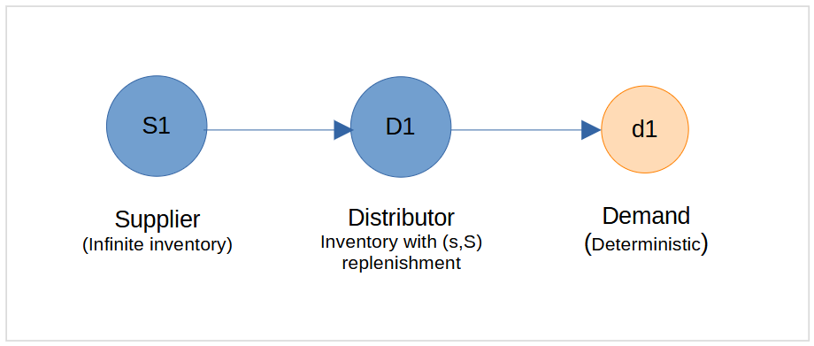

# SupplyNetPy in 10 Minutes

## Installation

You can install SupplyNetPy using pip:

```sh
pip install -i https://test.pypi.org/simple/ supplynetpy
```

## Quick Start: Building a Simple Three-Node Supply Chain

Follow these steps to create and simulate a basic supply chain with a supplier and a manufacturer:



### 1. Import the Library

```python
import SupplyNetPy.Components as scm
```
The `Components` module in SupplyNetPy offers essential building blocks for constructing supply chain networks. It enables you to define supply chain nodes, products, inventory, demand, and the links that connect them. Using these constructs, you can easily assemble and customize supply chain models to suit your requirements.

### 2. Define the Nodes

Let's define a supplier node in the supply chain that provides raw materials to the manufacturer for product assembly. The supplier node requires arguments such as `ID`, `name`, and `node_type`. In this example, we specify the type as `infinite_supplier`, meaning the supplier can fulfill any quantity requested by the manufacturer without limitation. The supplier node is created using the `default_raw_material`, which is configured with a unit cost of 1 per item, mining 30 units per extraction cycle of 3 days. You can modify the configuration of `default_raw_material` or create a new one to suit your requirements.

```python
supplier = {'ID': 'S1', 'name': 'Supplier', 'node_type': 'infinite_supplier'}
```

The supplier's behavior is to mine or extract raw materials and make them available to the manufacturer by maintaining an inventory. By default, the supplier is assumed to be associated with mining a single raw material and has infinite access to it.

Next, let's define a manufacturing node and a distributor node in the supply chain network. These can be created with parameters similar to those used above. These nodes take a `Product` as a parameter, which is produced by the `Manufacturer` and stored by the `InventoryNode`. If no product object is provided, they will be initialized with a `default_product`. The `default_product` is configured with manufacturing costs, manufacturing time, sell price, buy price, and the number of units produced per cycle, all set to default values. You can check these parameter values by running the `scm.default_product.get_info()` instruction. You may also reconfigure the default product or create a new one as needed.

```python
manufacturer = {'ID': 'M1', 'name': 'Manufacturer', 'node_type': 'manufacturer',
                'capacity': 300, 'initial_level': 50, 'inventory_holding_cost': 0.5,
                'replenishment_policy': 'sS', 'policy_param': [150], 'product_sell_price': 310}

distributor = {'ID': 'D1', 'name': 'Distributor', 'node_type': 'distributor',
               'capacity': 200, 'initial_level': 100, 'inventory_holding_cost': 1,
               'replenishment_policy': 'sS', 'policy_param': [100], 'product_sell_price': 320}
```

[qt]: ## "(Q,T): Replenish inventory every T days with Q units."
[ss]: ## "Continuously monitor inventory; replenish to capacity S when the level drops below s."

When creating a manufacturer, distributor, wholesaler, or retailer, you must specify the inventory replenishment policy and its parameters. Currently, SupplyNetPy supports two replenishment policies: [periodic][qt] replenishment and [reorder-level (s,S)][ss] replenishment.

### 3. Create a Link

Let's connect these nodes to form a supply chain network. In this example, we are building a simple supply chain with three nodes: the manufacturer receives raw materials from the supplier, and the distributor obtains finished products from the manufacturer. When creating these links, be sure to specify the transportation cost and lead time for each connection.

```python
link_s1m1 = {'ID': 'L1', 'source': 'S1', 'sink': 'M1', 'cost': 5, 'lead_time': lambda: 3}
link_m1d1 = {'ID': 'L2', 'source': 'M1', 'sink': 'D1', 'cost': 5, 'lead_time': lambda: 2}
```

### 4. Specify Demand

We are now ready to run the simulation, but we still need to specify the demand for this supply chain. Since there is no retailer in the network yet, let's create demand at the distributor. This represents direct demand faced by the distributor (for example, a distributor receiving orders for custom-made products). Demand requires both the order arrival and order quantity models to be provided as callable functions. These can be constant values or random number generators to model order arrivals and quantities.

```python
demand = {'ID': 'demand_D1', 'name': 'Demand at Distributor', 'node_type': 'demand',
          'order_arrival_model': lambda: 1, 'order_quantity_model': lambda: 10, 'demand_node': 'D1'}
```

### 5. Assemble and Simulate the Network

To create and simulate the supply chain, use the `create_sc_net` function to instantiate the supply chain nodes and assemble them into a network. This function adds metadata to your supply chain, such as the number of nodes, and other relevant information, keeping everything organized. It returns a Python dictionary containing all supply chain components and metadata. The `simulate_sc_net` function then simulates the supply chain network over a specified period and provides a log of the simulation run. It also calculates performance measures such as net profit, throughput, and more. Let's use these functions to build and simulate our supply chain.

```python
scnet = scm.create_sc_net([supplier, manufacturer, distributor], [link_s1m1, link_m1d1], [demand])
scnet = scm.simulate_sc_net(scnet, sim_time=30)
```

### 6. Review Results

After the simulation, inspect `scnet` to view performance metrics for the supply chain nodes. By default, the simulation log is displayed in the console and also saved to a local file named `simulation_trace.log` in the same directory as your Python script. Below is a sample simulation log generated by this program.

<div id="" style="overflow:scroll; height:600px;">
```
INFO sim_trace - 0:demand_D1:Demand at Distributor, Order quantity:10 received, inventory level:90.
INFO sim_trace - 1:M1: Raw materials' inventory levels:{'RM1': 0}, Product inventory levels:50
INFO sim_trace - 1:M1:Replenishing raw material:Raw Material 1 from supplier:S1, order placed for 750 units.
INFO sim_trace - 1:M1: Raw materials not available.
INFO sim_trace - 1:D1:Product not available at suppliers. Required quantity:110.
INFO sim_trace - 1:D1: Inventory levels:90
INFO sim_trace - 1:M1:shipment in transit from supplier:Supplier.
INFO sim_trace - 1:demand_D1:Demand at Distributor, Order quantity:10 received, inventory level:80.
INFO sim_trace - 2:M1: Raw materials' inventory levels:{'RM1': 0}, Product inventory levels:50
INFO sim_trace - 2:M1: Raw materials not available.
INFO sim_trace - 2:D1:Product not available at suppliers. Required quantity:120.
INFO sim_trace - 2:D1: Inventory levels:80
INFO sim_trace - 2:demand_D1:Demand at Distributor, Order quantity:10 received, inventory level:70.
INFO sim_trace - 3:M1: Raw materials' inventory levels:{'RM1': 0}, Product inventory levels:50
INFO sim_trace - 3:M1: Raw materials not available.
INFO sim_trace - 3:D1:Product not available at suppliers. Required quantity:130.
INFO sim_trace - 3:D1: Inventory levels:70
INFO sim_trace - 3:demand_D1:Demand at Distributor, Order quantity:10 received, inventory level:60.
INFO sim_trace - 4:M1:Order received from supplier:Supplier, inventory levels: {'RM1': 750}
INFO sim_trace - 4:M1: Raw materials' inventory levels:{'RM1': 750}, Product inventory levels:50
INFO sim_trace - 4:D1:Product not available at suppliers. Required quantity:140.
INFO sim_trace - 4:D1: Inventory levels:60
INFO sim_trace - 4:demand_D1:Demand at Distributor, Order quantity:10 received, inventory level:50.
INFO sim_trace - 5:M1: Raw materials' inventory levels:{'RM1': 750}, Product inventory levels:50
INFO sim_trace - 5:D1:Product not available at suppliers. Required quantity:150.
INFO sim_trace - 5:D1: Inventory levels:50
INFO sim_trace - 5:demand_D1:Demand at Distributor, Order quantity:10 received, inventory level:40.
INFO sim_trace - 6:M1: Raw materials' inventory levels:{'RM1': 750}, Product inventory levels:50
INFO sim_trace - 6:D1:Product not available at suppliers. Required quantity:160.
INFO sim_trace - 6:D1: Inventory levels:40
INFO sim_trace - 6:demand_D1:Demand at Distributor, Order quantity:10 received, inventory level:30.
INFO sim_trace - 7:M1: Raw material inventory levels:{'RM1': 660}
INFO sim_trace - 7:M1: 30 units manufactured.
INFO sim_trace - 7:M1: Product inventory levels:80
INFO sim_trace - 7:M1: Raw materials' inventory levels:{'RM1': 660}, Product inventory levels:80
INFO sim_trace - 7:D1:Product not available at suppliers. Required quantity:170.
INFO sim_trace - 7:D1: Inventory levels:30
INFO sim_trace - 7:demand_D1:Demand at Distributor, Order quantity:10 received, inventory level:20.
INFO sim_trace - 8:M1: Raw materials' inventory levels:{'RM1': 660}, Product inventory levels:80
INFO sim_trace - 8:D1:Product not available at suppliers. Required quantity:180.
INFO sim_trace - 8:D1: Inventory levels:20
INFO sim_trace - 8:demand_D1:Demand at Distributor, Order quantity:10 received, inventory level:10.
INFO sim_trace - 9:M1: Raw materials' inventory levels:{'RM1': 660}, Product inventory levels:80
INFO sim_trace - 9:D1:Product not available at suppliers. Required quantity:190.
INFO sim_trace - 9:D1: Inventory levels:10
INFO sim_trace - 9:demand_D1:Demand at Distributor, Order quantity:10 received, inventory level:0.
INFO sim_trace - 10:M1: Raw material inventory levels:{'RM1': 570}
INFO sim_trace - 10:M1: 30 units manufactured.
INFO sim_trace - 10:M1: Product inventory levels:110
INFO sim_trace - 10:M1: Raw materials' inventory levels:{'RM1': 570}, Product inventory levels:110
INFO sim_trace - 10:D1:Product not available at suppliers. Required quantity:200.
INFO sim_trace - 10:D1: Inventory levels:0
INFO sim_trace - 10:demand_D1:Demand at Distributor, Order quantity:10 not available, inventory level:0. No tolerance, shortage:10.
INFO sim_trace - 11:M1: Raw materials' inventory levels:{'RM1': 570}, Product inventory levels:110
INFO sim_trace - 11:D1:Product not available at suppliers. Required quantity:200.
INFO sim_trace - 11:D1: Inventory levels:0
INFO sim_trace - 11:demand_D1:Demand at Distributor, Order quantity:10 not available, inventory level:0. No tolerance, shortage:10.
INFO sim_trace - 12:M1: Raw materials' inventory levels:{'RM1': 570}, Product inventory levels:110
INFO sim_trace - 12:D1:Product not available at suppliers. Required quantity:200.
INFO sim_trace - 12:D1: Inventory levels:0
INFO sim_trace - 12:demand_D1:Demand at Distributor, Order quantity:10 not available, inventory level:0. No tolerance, shortage:10.
INFO sim_trace - 13:M1: Raw material inventory levels:{'RM1': 480}
INFO sim_trace - 13:M1: 30 units manufactured.
INFO sim_trace - 13:M1: Product inventory levels:140
INFO sim_trace - 13:M1: Raw materials' inventory levels:{'RM1': 480}, Product inventory levels:140
INFO sim_trace - 13:D1:Product not available at suppliers. Required quantity:200.
INFO sim_trace - 13:D1: Inventory levels:0
INFO sim_trace - 13:demand_D1:Demand at Distributor, Order quantity:10 not available, inventory level:0. No tolerance, shortage:10.
INFO sim_trace - 14:M1: Raw materials' inventory levels:{'RM1': 480}, Product inventory levels:140
INFO sim_trace - 14:D1:Product not available at suppliers. Required quantity:200.
INFO sim_trace - 14:D1: Inventory levels:0
INFO sim_trace - 14:demand_D1:Demand at Distributor, Order quantity:10 not available, inventory level:0. No tolerance, shortage:10.
INFO sim_trace - 15:M1: Raw materials' inventory levels:{'RM1': 480}, Product inventory levels:140
INFO sim_trace - 15:D1:Product not available at suppliers. Required quantity:200.
INFO sim_trace - 15:D1: Inventory levels:0
INFO sim_trace - 15:demand_D1:Demand at Distributor, Order quantity:10 not available, inventory level:0. No tolerance, shortage:10.
INFO sim_trace - 16:M1: Raw material inventory levels:{'RM1': 390}
INFO sim_trace - 16:M1: 30 units manufactured.
INFO sim_trace - 16:M1: Product inventory levels:170
INFO sim_trace - 16:M1: Raw materials' inventory levels:{'RM1': 390}, Product inventory levels:170
INFO sim_trace - 16:D1:Product not available at suppliers. Required quantity:200.
INFO sim_trace - 16:D1: Inventory levels:0
INFO sim_trace - 16:demand_D1:Demand at Distributor, Order quantity:10 not available, inventory level:0. No tolerance, shortage:10.
INFO sim_trace - 17:M1: Raw materials' inventory levels:{'RM1': 390}, Product inventory levels:170
INFO sim_trace - 17:D1:Product not available at suppliers. Required quantity:200.
INFO sim_trace - 17:D1: Inventory levels:0
INFO sim_trace - 17:demand_D1:Demand at Distributor, Order quantity:10 not available, inventory level:0. No tolerance, shortage:10.
INFO sim_trace - 18:M1: Raw materials' inventory levels:{'RM1': 390}, Product inventory levels:170
INFO sim_trace - 18:D1:Product not available at suppliers. Required quantity:200.
INFO sim_trace - 18:D1: Inventory levels:0
INFO sim_trace - 18:demand_D1:Demand at Distributor, Order quantity:10 not available, inventory level:0. No tolerance, shortage:10.
INFO sim_trace - 19:M1: Raw material inventory levels:{'RM1': 300}
INFO sim_trace - 19:M1: 30 units manufactured.
INFO sim_trace - 19:M1: Product inventory levels:200
INFO sim_trace - 19:M1: Raw materials' inventory levels:{'RM1': 300}, Product inventory levels:200
INFO sim_trace - 19:D1: Inventory levels:0
INFO sim_trace - 19:D1:Replenishing inventory from supplier:Manufacturer, order placed for 200 units.
INFO sim_trace - 19:demand_D1:Demand at Distributor, Order quantity:10 not available, inventory level:0. No tolerance, shortage:10.
INFO sim_trace - 19:D1:shipment in transit from supplier:Manufacturer.
INFO sim_trace - 20:M1: Raw materials' inventory levels:{'RM1': 300}, Product inventory levels:0
INFO sim_trace - 20:M1:Replenishing raw material:Raw Material 1 from supplier:S1, order placed for 600 units.
INFO sim_trace - 20:D1: Inventory levels:0
INFO sim_trace - 20:demand_D1:Demand at Distributor, Order quantity:10 not available, inventory level:0. No tolerance, shortage:10.
INFO sim_trace - 20:M1:shipment in transit from supplier:Supplier.
INFO sim_trace - 21:D1:Inventory replenished. Inventory levels:200
INFO sim_trace - 21:M1: Raw materials' inventory levels:{'RM1': 300}, Product inventory levels:0
INFO sim_trace - 21:D1: Inventory levels:200
INFO sim_trace - 21:demand_D1:Demand at Distributor, Order quantity:10 received, inventory level:190.
INFO sim_trace - 22:M1: Raw material inventory levels:{'RM1': 210}
INFO sim_trace - 22:M1: 30 units manufactured.
INFO sim_trace - 22:M1: Product inventory levels:30
INFO sim_trace - 22:M1: Raw materials' inventory levels:{'RM1': 210}, Product inventory levels:30
INFO sim_trace - 22:D1: Inventory levels:190
INFO sim_trace - 22:demand_D1:Demand at Distributor, Order quantity:10 received, inventory level:180.
INFO sim_trace - 23:M1:Order received from supplier:Supplier, inventory levels: {'RM1': 810}
INFO sim_trace - 23:M1: Raw materials' inventory levels:{'RM1': 810}, Product inventory levels:30
INFO sim_trace - 23:D1: Inventory levels:180
INFO sim_trace - 23:demand_D1:Demand at Distributor, Order quantity:10 received, inventory level:170.
INFO sim_trace - 24:M1: Raw materials' inventory levels:{'RM1': 810}, Product inventory levels:30
INFO sim_trace - 24:D1: Inventory levels:170
INFO sim_trace - 24:demand_D1:Demand at Distributor, Order quantity:10 received, inventory level:160.
INFO sim_trace - 25:M1: Raw material inventory levels:{'RM1': 720}
INFO sim_trace - 25:M1: 30 units manufactured.
INFO sim_trace - 25:M1: Product inventory levels:60
INFO sim_trace - 25:M1: Raw materials' inventory levels:{'RM1': 720}, Product inventory levels:60
INFO sim_trace - 25:D1: Inventory levels:160
INFO sim_trace - 25:demand_D1:Demand at Distributor, Order quantity:10 received, inventory level:150.
INFO sim_trace - 26:M1: Raw materials' inventory levels:{'RM1': 720}, Product inventory levels:60
INFO sim_trace - 26:D1: Inventory levels:150
INFO sim_trace - 26:demand_D1:Demand at Distributor, Order quantity:10 received, inventory level:140.
INFO sim_trace - 27:M1: Raw materials' inventory levels:{'RM1': 720}, Product inventory levels:60
INFO sim_trace - 27:D1: Inventory levels:140
INFO sim_trace - 27:demand_D1:Demand at Distributor, Order quantity:10 received, inventory level:130.
INFO sim_trace - 28:M1: Raw material inventory levels:{'RM1': 630}
INFO sim_trace - 28:M1: 30 units manufactured.
INFO sim_trace - 28:M1: Product inventory levels:90
INFO sim_trace - 28:M1: Raw materials' inventory levels:{'RM1': 630}, Product inventory levels:90
INFO sim_trace - 28:D1: Inventory levels:130
INFO sim_trace - 28:demand_D1:Demand at Distributor, Order quantity:10 received, inventory level:120.
INFO sim_trace - 29:M1: Raw materials' inventory levels:{'RM1': 630}, Product inventory levels:90
INFO sim_trace - 29:D1: Inventory levels:120
INFO sim_trace - 29:demand_D1:Demand at Distributor, Order quantity:10 received, inventory level:110.
INFO sim_trace - Node S1 performance measures:
INFO sim_trace -        Inventory cost = 0
INFO sim_trace -        Transportation cost = 0
INFO sim_trace -        Mining cost = 0
INFO sim_trace -        Node cost = 0
INFO sim_trace -        Total products sold = 1350
INFO sim_trace -        Profit = 0
INFO sim_trace -        Net profit = 0
INFO sim_trace - Node M1 performance measures:
INFO sim_trace -        Inventory cost = 1225.0
INFO sim_trace -        Transportation cost = 10
INFO sim_trace -        Manufacturing cost = 12000
INFO sim_trace -        Node cost = 13235.0
INFO sim_trace -        Total products sold = 200
INFO sim_trace -        Profit = 51400
INFO sim_trace -        Net profit = 38165.0
INFO sim_trace - Node D1 performance measures:
INFO sim_trace -        Inventory cost = 1890
INFO sim_trace -        Transportation cost = 5
INFO sim_trace -        Node cost = 1895
INFO sim_trace -        Total products sold = 190
INFO sim_trace -        Profit = 1900
INFO sim_trace -        Net profit = 5
INFO sim_trace - Demand demand_D1 performance measures:
INFO sim_trace -        Total demand = 300
INFO sim_trace -        Total products sold = 190
INFO sim_trace -        Unsatisfied demand = 110
INFO sim_trace -        Shortage = 110
INFO sim_trace - Supply chain performance:
INFO sim_trace -        Number of products sold = 190
INFO sim_trace -        SC inventory cost = 3115.0
INFO sim_trace -        SC total tranportation cost = 15
INFO sim_trace -        SC total cost = 15130.0
INFO sim_trace -        SC total net profit = 38170.0
INFO sim_trace -        Unsatisfied demand  = 110
```
</div>

---

## Alternative Approach: Using Object-Oriented API

This approach demonstrates how to build and simulate a supply chain using SupplyNetPy's object-oriented API. Instead of passing dictionaries to utility functions, you instantiate supply chain components as Python objects, providing greater flexibility and extensibility. Each node and link is created as an object, and the simulation is managed within a SimPy environment, allowing for more advanced customization and integration with other SimPy-based processes.

```python
import SupplyNetPy.Components as scm
import simpy
env = simpy.Environment() # create a simpy environment

supplier = scm.Supplier(env=env, ID='S1', name='Supplier', node_type='infinite_supplier') # create an infinite supplier 
manufacturer = scm.Manufacturer(env=env, ID='M1', name='Manufacturer', node_type='manufacturer', 
                                capacity=300, initial_level=50, inventory_holding_cost=0.5,
                                replenishment_policy='sS', policy_param=[150], product_sell_price=310)

distributor = (ID='D1', name='Distributor', node_type='distributor',
               capacity=200, initial_level=100, inventory_holding_cost=1,
               replenishment_policy='sS', policy_param=[100], product_sell_price=320)

link_s1m1 = (ID='L1', source='S1', sink='M1', cost=5, lead_time=lambda: 3)
link_m1d1 = (ID='L2', source='M1', sink='D1', cost=5, lead_time=lambda: 2)

demand = (ID='demand_D1', name='Demand at Distributor', node_type='demand',
          order_arrival_model=lambda: 1, order_quantity_model=lambda: 10, demand_node='D1')
env.run(until=30)

```
After running the simulation, the simulation log will be printed to the screen, just as with the functional API. However, to view a summary of the supply chain's performance (such as inventory costs, transportation costs and profits), you need to call the `get_statistics()` method on each node object. For example:

```python
print(manufacturer.get_statistics())
print(distributor.get_statistics())
print(supplier.get_statistics())
```

This will display detailed performance metrics for each node in the supply chain.